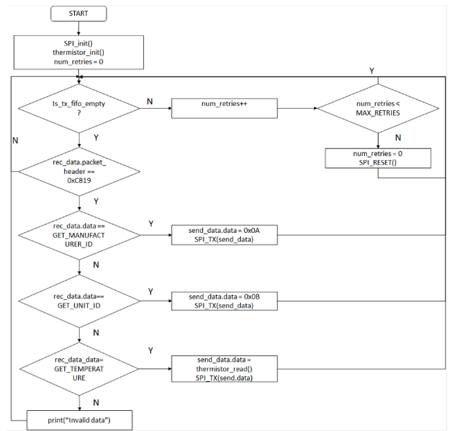

# CE229103 SPI

This code example includes two applications that demonstrate the operation of Serial Peripheral Interface (SPI) interface using the CYW20719B2 Bluetooth SoC and ModusToolbox™. The first application demonstrates the operation of SPI master – for collecting sensor data. The second application demonstrates the operation of an SPI slave used for providing sensor data to the first application, i.e. SPI master.

# Requirements
- **Tool**: [ModusToolbox IDE v 2.x](https://www.cypress.com/products/modustoolbox-software-environment)

- **Programming Language**: C

- **Associated Parts**: [CYW20719B2](https://community.cypress.com/docs/DOC-17736)

# Supported Kits
[CYW920719B2Q40EVB-01 Evaluation kit](https://community.cypress.com/docs/DOC-17736)

# Hardware Setup
These applications run on two separate kits. Both of them use the kit's default configuration. [Figure 1](#figure-1-block-diagram) shows the block diagram depicting the connections between different blocks of two evaluation boards.

Figure 1. Block diagram


Table 1. Hardware Connections

| Function | Master GPIO    | EVB Header pin      | Arduino Header     | Slave GPIO     | EVB Header pin     | Arduino Header     |
| -------- | --------- | ----- | ---- | --------- | ----- | ---- |
| CLK      | WICED_P38 | J3.5  | D13  | WICED_P38 | J3.5  | D13  |
| MISO     | WICED_P01 | J3.6  | D12  | WICED_P01 | J3.6  | D12  |
| MOSI     | WICED_P06 | J3.10 | D8   | WICED_P06 | J3.10 | D8   |
| CS       | WICED_P02 | J4.2  | D6  | WICED_P02 | J4.2  | D6  |
| GND      | GND       | J3.4  | GND  | GND       | J3.4  | GND  |

### **Note**: 
The device configurator currently requires all 4 pins namely MISO, MOSI, CLK and CS while configuring SPI. The CS pin configured via device configurator is handled by SPI block internally and the application does not get to control it. If application control for CS is required or you want to select between multiple slaves, you will have to configure the pin/pins as GPIO and control it from the application. This application shows how to do the same. The trade off here is that the pin which you supplied as CS in device configurator will be wasted. This is applicable for SPI Master and will be fixed soon.

# Software Setup
Install a terminal emulator if you don't have one. Instructions in this document uses [TeraTerm](https://ttssh2.osdn.jp/index.html.en)

This example requires no additional software or tools.

# Using the Code Example

## In ModusToolbox IDE

1. Make the hardware connections as defined in Table 1 between two boards.
2. Install ModusToolbox™ 2.x.
3. In the ModusToolbox™ IDE, click the **New Application** link in the Quick Panel (or, use **File > New > ModusToolbox IDE Application**).
4. Pick your board for BTSDK.
5. First select **wiced\_btsdk**. This project contains the SDK. It is used by all BTSDK applications. You will need to create this project just once in the working directory (i.e. Eclipse workspace).

   *Note: Do not change the name of this project. All BTSDK apps use this project name in application makefiles.*

6. After the 'wiced\_btsdk' project is created, click the **New Application** link again, and select the board and click *next*.
7. Select **SPI** application and click **next**. Click on **finish** to create the application. Two apps are created in the workspace. One is SPI_Master and another is SPI_Slave.
8. Select the **SPI_Master** application in the IDE. In the Quick Panel, select **Build** to build the application.
9. Two boards are required. To program the first board (download the application), select **Program** in the Quick Panel. Unplug the board.
10. Next, select **SPI_Slave** application and in the Quick Panel, select **Build** to build the application.
11. Plug in another board and select **Program** in the Quick Panel. After successfully programming the second app, plug in the first board which has SPI_master app running.
   
## In Command-line Interface (CLI)

1. Install ModusToolbox™ 2.x.
2. On Windows, use Cygwin from \ModusToolbox\tools_2.x\modus-shell\Cygwin.bat to build apps.
3. git clone `wiced_btsdk` repo first. As mentioned earlier, this project contains the SDK used by all apps. You will need to create this project just once in the working directory. For example:
   > git clone https://github.com/cypresssemiconductorco/wiced_btsdk
4. git clone the app repo mtb-example-btsdk-cyw20719b2-spi. The application repo directory should be at the same folder level as 'wiced_btsdk'. For example:
   > git clone https://github.com/cypresssemiconductorco/mtb-example-btsdk-cyw20719b2-spi

5. The `wiced_btsdk` repo contains references to other repos. To download all the required collateral, `cd` to root folder and use `make getlibs`.
   ```
   > cd wiced_btsdk
   > make getlibs
   ```
6. In this example, there are two apps as already mentioned. One for SPI master and another for SPI slave. First navigate into SPI master app and call `make build`:
   ```
   > cd ../mtb-example-btsdk-cyw20719b2-spi/SPI_Master
   > make build
   ```
7. Connect the first board. To program (download to) the board, call `make qprogram`:
   ```
   > make qprogram
   ```
   Unplug the board.

8. Next come out of SPI master app and navigate to SPI slave app path:
   ```
   > cd ../SPI_Slave
   ```
9. Build the app:
   ```
   > make build
   ```

10. Connect second board and program it:
    ```
    > make qprogram
    ```
   After successfully programming the second app, plug in the first board.

11. To build and program (download to) the board, call `make program` from respective app paths:
    ```
    > make program
    ```

   *Note: `make program` = `make build` + `make qprogram`*


# Operation
1. Connect two boards to your PC using the provided USB cable. Note down the port enumerations for each device in **Device Manager** > **Ports** (**COM & LPT**) (Windows only). The enumeration with a smaller number is the **WICED HCI UART port** and the other is **WICED Peripheral UART port**.

2. Open a terminal program and select the **WICED Peripheral UART** port for each board. Set the serial port parameters to 8N1 and 115200 baud. We need two windows of serial terminal to view messages from SPI master and SPI slave.

3. Program one board with SPI master example and another with SPI slave example.

   **Note**: If the download fails, it is possible that a previously loaded application is preventing programming. For example, application might use a custom baud rate that the download process does not detect or it might be in a low power mode. In that case, it may be necessary to put the board in recovery mode, and then try the programming operation again from the IDE. To enter recovery mode, first, press and hold the Recover button (SW1), then press the Reset button (SW2), release the Reset button (SW2), and then release the Recover button (SW1).

4. After programming, applications start automatically.

5. The master and slave serial terminal window display the received SPI command and the accompanying response on the terminal window, as shown in [Figure 2](#serial-terminal-output-of-spi-master) and [Figure 3](#serial-terminal-output-of-spi-slave).

   Figure 2. Serial Terminal Output of SPI master


​	Figure 3. Serial Terminal Output of SPI slave


# Design and Implementation

## SPI Master

This section describes the details of the implementation of the SPI Master.

On startup, the application sets up the UART and then starts the Bluetooth stack in `application_start()`. Once the stack is started (`BTM_ENABLED_EVT`), it calls the `initialize_app()` function, which handles the remaining functionality. Note that the Bluetooth stack is running; since Bluetooth is not used in this application, it does not do anything once the stack is started. The `initialize_app()` function initializes both the SPI interfaces, RTC, GPIO and a thread to read SPI sensor.

Following is the description of the variables used:

- `dec_temp`: Holds the decimal part of the temperature reading
- `frac_temp`: Holds the fractional part of the temperature reading

In the thread handling SPI communication with the slave (`spi_sensor_thread`), a finite state machine is used to determine the data that the master requests, as shown in [Figure 4](#Finite-state-machine-adopted-for-communicating-with-slave).

Figure 4. Finite State Machine Adopted for Communicating with Slave


The finite state machine contains three states:

- `SENSOR_DETECT`
- `READ_UNIT`
- `READ_TEMPERATURE`

In each state, the slave is verified to be a known slave using a packet header before processing the data that is sent from the slave. If the master is not able to authenticate the slave, the master remains in the same state and retries. After five retries, the SPI interface is reset, and the master starts from the `SENSOR_DETECT` state.

In the `SENSOR_DETECT` state, the master requests the Manufacturer ID to verify whether the slave’s manufacturer is Cypress. If the slave responds with an unknown Manufacturer ID, the master informs the user that the slave’s identity could not be authenticated. If the slave responds with the expected Manufacturer ID, the master enters the next state, `READ_UNIT`. A flowchart illustrating the operation is shown in [Figure 5](#Flowchart-of-SENSOR_DETECT-State). 

Figure 5. Flowchart of SENSOR_DETECT State


Unit ID to know the unit of temperature values provided by the slave. If the slave responds with an unknown Unit ID, the master informs the user that the unit of temperature is unknown and tries to obtain the unit again. If the number of retries exceeds 5, the master changes its state to `SENSOR_DETECT`. Otherwise, if the slave responds as expected, the master enters the next state, `READ_TEMPERATURE`. A flowchart illustrating the operation is shown in [Figure 6](#Flowchart-of-READ_UNIT-State).

Figure 6. Flowchart of READ_UNIT State


In the `READ_TEMPERATURE` state, the master requests the temperature from the slave. The temperature reading received comprises the decimal and fractional parts of the temperature. For instance, if the temperature reading is 24.44 °C, the slave sends 2444 as the data. The master then stores the quotient as the decimal part of temperature and remainder as the fractional part of temperature in the temperature record. A flowchart illustrating the operation is shown in [Figure 7](#Flowchart-of-READ_TEMPERATURE-state). 

Figure 7. Flowchart of READ_TEMPERATURE State


The application level source files for *spi_master* is listed in [Table 2](#table-2-application-source-files).

##### Table 2. Application Source Files

| **File Name**  | **Comments**                                                 |
| -------------- | ------------------------------------------------------------ |
| *spi_master.c* | Contains the `application_start()` function which is the entry point for execution of the user application code after device startup  and the thread that handle SPI communication with sensor. |

## SPI Slave

This section describes the operation of the slave. As with the master, `application_start()` sets up the UART and then starts the Bluetooth stack. Once the stack is started (`BTM_ENABLED_EVT`), it initializes the ADC and then calls the `initialize_app()` function which handles the remaining functionality. Note that the Bluetooth stack is running; since Bluetooth is not used in this application, it does not do anything once the stack is started. The `initialize_app()` function sets up the SPI interface, initializes the thermistor and then waits for and responds to SPI master commands. There are three commands that the slave will respond to:

- Manufacturer ID: The slave responds with its Manufacturer ID.
- Unit ID: The slave responds with its Unit ID
- Temperature: The slave responds with a temperature reading obtained by acquiring ADC samples

The slave reads from SPI Rx buffers only when its Tx buffers are empty. If the slave is unable to empty the Tx buffers after several retries, the SPI interface is reset. A flowchart illustrating the operation of the slave is shown in [Figure 8](#figure-8-spi-slave-operation).

Figure 8. SPI Slave operation



The application level source files for “spi_slave” are listed in [Table 3](#table-3-application-source-files).

##### Table 3. Application Source Files

| **File Name**                                | **Comments**                                                 |
| -------------------------------------------- | ------------------------------------------------------------ |
| *spi_slave.c*                     | Contains the `application_start()` function which is the entry point for execution of the user application code after device startup. |

## Resources and Settings
This section explains the ModusToolbox resources and their configuration as used in this code example. Note that all the configuration explained in this section has already been done in the code example. 
The ModusToolbox IDE stores the configuration settings of the application in the *design.modus* file. This file is used by the dveice configurators, which generate the configuration firmware. It is present in the respective kit BSP folder in *wiced_btsdk* project. For example for CYW920719B2Q40EVB-01 the path is *<workspace_path>/wiced_btsdk/dev-kit/bsp/TARGET_CYW920719B2Q40EVB-01/COMPONENT_bsp_design_modus/design.modus*.


### Device Configurator 
The Device Configurator is used to enable/configure the peripherals and the pins used in the application. See the [Device Configurator Guide](https://www.cypress.com/file/492971/download).


### Bluetooth Configurator: 
The Bluetooth Configurator is used for generating/modifying the BLE GATT database. See the [Bluetooth Configurator Guide](https://www.cypress.com/file/492891/download).

## Related Resources

| **Tool Documentation**                                       |                                                              |
| ------------------------------------------------------------ | ------------------------------------------------------------ |
| [ModusToolbox IDE](http://www.cypress.com/modustoolbox)      | The Cypress IDE for IoT designers                 |
| **Device Information**                                       |                                                              |
| [CYW20719B2 Product guide](https://community.cypress.com/docs/DOC-17736) | Documentation related to CYW20719B2 and CYW920719B2Q40EVB-01 Evaluation kit |

### Other Resources

Cypress provides a wealth of data at [www.cypress.com](http://www.cypress.com) to help you to select the right device, and quickly and effectively integrate the device into your design.

## Document History

Document Title: *CE229103* – *SPI*

| Version | Description of Change |
| ------- | --------------------- |
| 1.0.0   | New code example      |

------

All other trademarks or registered trademarks referenced herein are the property of their respective owners.


------

© Cypress Semiconductor Corporation, 2020. This document is the property of Cypress Semiconductor Corporation and its subsidiaries ("Cypress"). This document, including any software or firmware included or referenced in this document ("Software"), is owned by Cypress under the intellectual property laws and treaties of the United States and other countries worldwide. Cypress reserves all rights under such laws and treaties and does not, except as specifically stated in this paragraph, grant any license under its patents, copyrights, trademarks, or other intellectual property rights. If the Software is not accompanied by a license agreement and you do not otherwise have a written agreement with Cypress governing the use of the Software, then Cypress hereby grants you a personal, non-exclusive, nontransferable license (without the right to sublicense) (1) under its copyright rights in the Software (a) for Software provided in source code form, to modify and reproduce the Software solely for use with Cypress hardware products, only internally within your organization, and (b) to distribute the Software in binary code form externally to end users (either directly or indirectly through resellers and distributors), solely for use on Cypress hardware product units, and (2) under those claims of Cypress's patents that are infringed by the Software (as provided by Cypress, unmodified) to make, use, distribute, and import the Software solely for use with Cypress hardware products. Any other use, reproduction, modification, translation, or compilation of the Software is prohibited.
 TO THE EXTENT PERMITTED BY APPLICABLE LAW, CYPRESS MAKES NO WARRANTY OF ANY KIND, EXPRESS OR IMPLIED, WITH REGARD TO THIS DOCUMENT OR ANY SOFTWARE OR ACCOMPANYING HARDWARE, INCLUDING, BUT NOT LIMITED TO, THE IMPLIED WARRANTIES OF MERCHANTABILITY AND FITNESS FOR A PARTICULAR PURPOSE. No computing device can be absolutely secure. Therefore, despite security measures implemented in Cypress hardware or software products, Cypress shall have no liability arising out of any security breach, such as unauthorized access to or use of a Cypress product. CYPRESS DOES NOT REPRESENT, WARRANT, OR GUARANTEE THAT CYPRESS PRODUCTS, OR SYSTEMS CREATED USING CYPRESS PRODUCTS, WILL BE FREE FROM CORRUPTION, ATTACK, VIRUSES, INTERFERENCE, HACKING, DATA LOSS OR THEFT, OR OTHER SECURITY INTRUSION (collectively, "Security Breach"). Cypress disclaims any liability relating to any Security Breach, and you shall and hereby do release Cypress from any claim, damage, or other liability arising from any Security Breach. In addition, the products described in these materials may contain design defects or errors known as errata which may cause the product to deviate from published specifications. To the extent permitted by applicable law, Cypress reserves the right to make changes to this document without further notice. Cypress does not assume any liability arising out of the application or use of any product or circuit described in this document. Any information provided in this document, including any sample design information or programming code, is provided only for reference purposes. It is the responsibility of the user of this document to properly design, program, and test the functionality and safety of any application made of this information and any resulting product. "High-Risk Device" means any device or system whose failure could cause personal injury, death, or property damage. Examples of High-Risk Devices are weapons, nuclear installations, surgical implants, and other medical devices. "Critical Component" means any component of a High-Risk Device whose failure to perform can be reasonably expected to cause, directly or indirectly, the failure of the High-Risk Device, or to affect its safety or effectiveness. Cypress is not liable, in whole or in part, and you shall and hereby do release Cypress from any claim, damage, or other liability arising from any use of a Cypress product as a Critical Component in a High-Risk Device. You shall indemnify and hold Cypress, its directors, officers, employees, agents, affiliates, distributors, and assigns harmless from and against all claims, costs, damages, and expenses, arising out of any claim, including claims for product liability, personal injury or death, or property damage arising from any use of a Cypress product as a Critical Component in a High-Risk Device. Cypress products are not intended or authorized for use as a Critical Component in any High-Risk Device except to the limited extent that (i) Cypress's published data sheet for the product explicitly states Cypress has qualified the product for use in a specific High-Risk Device, or (ii) Cypress has given you advance written authorization to use the product as a Critical Component in the specific High-Risk Device and you have signed a separate indemnification agreement.
 Cypress, the Cypress logo, Spansion, the Spansion logo, and combinations thereof, WICED, PSoC, CapSense, EZ-USB, F-RAM, and Traveo are trademarks or registered trademarks of Cypress in the United States and other countries. For a more complete list of Cypress trademarks, visit [cypress.com](https://www.cypress.com/). Other names and brands may be claimed as property of their respective owners.


