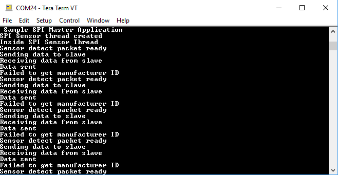
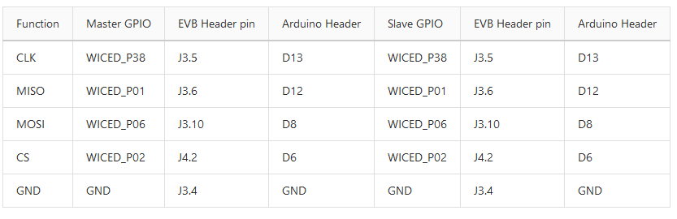
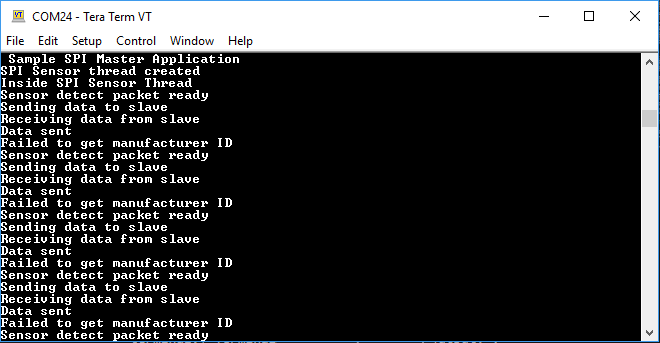
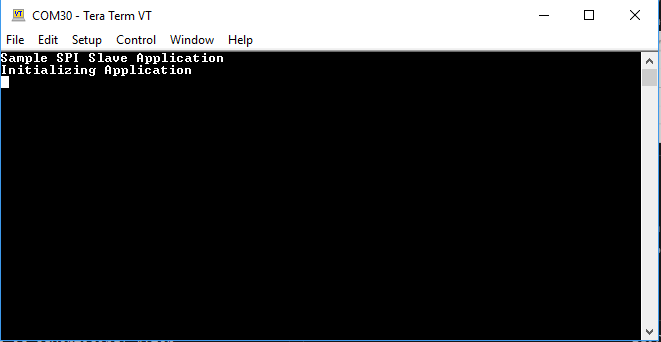
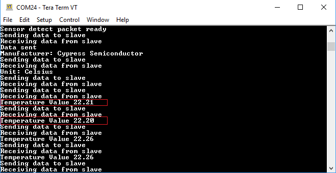

# Test Plan for SPI Master example

|Test Case ID| Steps      | Expected result|
|------------|------------|----------------|
| 1          | **Basic Test**: *Build and Program test:* Build the project and program the kit with SPI master example.| The project builds and programs successfully.|
|2	         | **Basic Test**: *UART TEST* - After executing test#1, connect the kit to a PC and open terminal at 115200 baud. Press the reset button on kit.	| Terminal displays the following: |
|3           | **Advanced Test** : *Hardware connection test:* SPI lines need to be connected between kit 1 and 2. Make the hardware connections. .| Following table shows the hardware connections: |
|4           | **Advanced Test** : *Connection test:* Once the kit 2 is programmed with SPI slave example and hardware connections are done, you can see temperature values on SPI master serial terminal| Terminal displays following output: |
|5	         | **Advenced Test** : *Connection failure test:* If SPI master failes to get the correct slave ID, it will show error.|  |

# Test Plan for SPI Slave example

|Test Case ID| Steps      | Expected result|
|------------|------------|----------------|
| 1          | **Basic Test**: *Build and Program test:* Build the project and program the kit with SPI slave example.| The project builds and programs successfully.|
|2	         | **Basic Test**: *UART TEST* - After executing test#1, connect the kit to a PC and open terminal at 115200 baud. Press the reset button on kit.	| Terminal displays the following: SPI slave waits in this state unless master is connected.|
|3           | **Advanced Test** : *Connection test:* After both the kits are programmed and and hardware connections are done, you can see temperature values on SPI slave serial terminal.| Terminal displays following output: |

> **Note:** Basic test category meant for quick sanity test of the example with any updated dependency assets. Advance tests are to cover the complete example functionality when the implementation/design gets changed.

Test cases were executed using HEX files generated using the following combinations:

<!-- **IDE flow**: refers to testing by creating the project using the ModusToolbox IDE’s New project wizard, followed by programming using the Quick launch setting. See the Readme’s Using the Code Example -> In ModusToolbox IDE section for steps. -->

**CLI flow**: refers to testing by creating the project by downloading or cloning the project repo and building and programming from the CLI. See the Readme’s Operation -> Using ModusToolbox IDE section for details.

**TOOLCHAIN** = Toolchain used for building the application (GCC_ARM)

**TARGET** = Supported kit target (See README for supported kits:)
  * CYW920719B2Q40EVB-01
